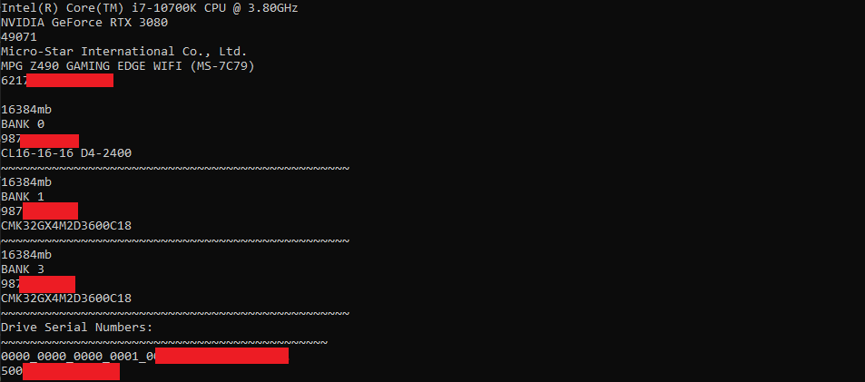

# Advanced Hardware Collection

 
Normally when gathering hardware for windows systems we tend to use [WMIC](https://learn.microsoft.com/en-us/windows/win32/wmisdk/wmic), The issue with this is that its easy to target from usermode and there are many ways to just spoof the values with ease. Additionally it means relying on windows tech that was nearly depricated in windows 11.
 
This project is an alternative to using WMIC for grabbing important hardware information required to create a digital fingerprint. Using various different methods which are harder to manipulate either due to their complexity in managing data or due to using various under documented subsystems.
 
The issue with grabbing hardware from windows as a usermode program is just how easy it is to manipulate the hardware values as you're at the mercy of subsystems, drivers and various interfaces. We want to raise the barrier for anti platform shenanigans.

## Images

  

## Features
* CPU
  * Name
  * Speed
  * Manufacturer
* GPU
  * Name
* Memory
  * Total Memory
  * Dim/Slot
  * Stick Memory
  * Serial Number
  * Model
* Motherboard
  * Name
  * Serial
  * Manufacturer
* Physical Disk Drives
  * Serial Numbers
 
## Explaining Functionality
CPU: We grab the CPU details through the CPUID function to retrieve the first 4 tables which we use the 1,2,3 tables which contain the Manufacturer, Model, Speed. This in theory would be extremely easy to hook but the way the data is handled just gives it an edge, Its also much more platform independant than WMIC.
 
 
GPU: Grabbing GPU outside WMIC was a pain to find with many posts on stack overflow claiming it to be impossible. Luckily Unreal Engine's forums talked about using graphical APIs to get them. You can easily change the graphics api to Vulkan, OpenGL, Any other DX version you're using. Very platform independant. It should be somewhat secure from usermode mischief since it will be going through goodness knows what subsystem which will depend on the graphics API you choose.
 
 
Memory: We use SMBIOS to filter data.  I repurposed [SMBIOS-Parser](https://github.com/saibulusu/SMBIOS-Parser) to simply gather memory information. The way that SMBIOS handles data at the usermode components is very obsecure which is a perfect system to detour attackers from attacking any of the pipelines from usermode.
 
 
Motherboard: Similarly to Memory we use SMBIOS to get the data. Using our repurposed [SMBIOS-Parser](https://github.com/saibulusu/SMBIOS-Parser) we filter out the Serial number, manufacturer and model to easily identify the motherboard.
 
 
Physical Drives: Most cases with gathering drive information you tend to see people using volumeids which is something I wanted to avoid so we check for the device pipeline/ sharedmemory and then bruteforce the amount of devices. This has a higher chance of failure but it will successfully get the drive information. 
